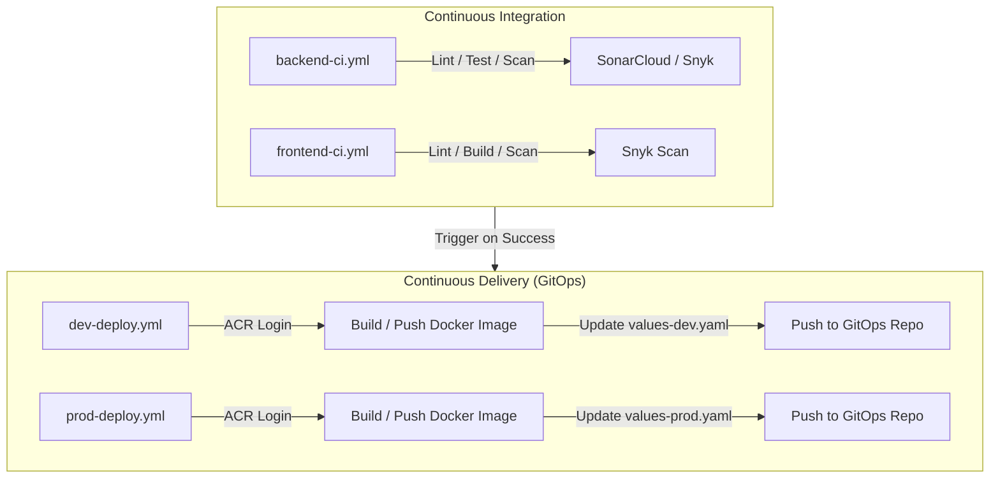

# OpsGPT Shared CI/CD Workflows

This directory houses the reusable **GitHub Actions workflow templates** for the OpsGPT platform. These workflows centralize testing, quality scans, security auditing, containerization, and GitOps deployments, ensuring unified standards across all frontend and backend microservices.

---

## Workflow Architecture



---

## Workflow Inventory

### 1. `backend-ci.yml` (Backend CI Template)
Triggered by backend microservices to lint code, run tests, and perform vulnerability checks:
*   **Steps**:
    1. Sets up the specified Python version (default: `3.11`).
    2. Installs requirements from `requirements.txt`.
    3. Runs **Flake8** for code style enforcement.
    4. Runs **PyTest** for unit and integration testing.
    5. Executes **SonarCloud Scan** to assess code quality and code coverage (if `SONAR_TOKEN` is provided).
    6. Runs **Snyk Security Scan** to audit dependency vulnerabilities (if `SNYK_TOKEN` is provided).

### 2. `frontend-ci.yml` (Frontend CI Template)
Triggered by React web components to compile resources and scan packages:
*   **Steps**:
    1. Sets up Node.js environment.
    2. Installs dependencies using `npm ci`.
    3. Compiles the project using `npm run build` to verify bundler configurations.
    4. Performs **Snyk Security Scan** to detect vulnerable node packages.

### 3. `dev-deploy.yml` (Dev Deploy Template)
Builds images and updates the GitOps manifest configurations targeting the `dev` environment:
*   **Steps**:
    1. Authenticates to Azure CLI and Azure Container Registry (ACR) using **OIDC Workload Identity** (no long-lived service principal passwords required).
    2. Builds the Dockerfile and pushes the image tagged with the commit SHA and `:dev` to ACR.
    3. Clones the target GitOps repository containing Helm deployment values.
    4. Modifies the image tag field inside `values-dev.yaml` dynamically using **`yq`**.
    5. Commits and pushes the modified tag back to GitHub, triggering **ArgoCD** to synchronize the deployment.

### 4. `prod-deploy.yml` (Prod Deploy Template)
Handles production-level builds, image tagging, and GitOps releases:
*   **Steps**:
    1. Logs in to Azure and ACR via OIDC.
    2. Builds and tags the Docker image with the production tag and `:prod`.
    3. Checks out the production configurations repository.
    4. Modifies the production image tag inside `values-prod.yaml` using `yq`.
    5. Commits and pushes changes, prompting ArgoCD to sync the changes to the production AKS namespace.

---

## Inputs and Secrets Configuration

To call these workflows, define a workflow file under the service's `.github/workflows/` directory.

### Example Caller Setup (`dev-ci-cd.yml`)

```yaml
jobs:
  ci:
    uses: OpsGPT-v1/shared-workflow/.github/workflows/backend-ci.yml@main
    with:
      service_name: "core-api-service"
      working_directory: "core-api-service"
    secrets:
      SONAR_TOKEN: ${{ secrets.SONAR_TOKEN }}
      SNYK_TOKEN: ${{ secrets.SNYK_TOKEN }}

  deploy:
    needs: ci
    uses: OpsGPT-v1/shared-workflow/.github/workflows/dev-deploy.yml@main
    with:
      service_name: "core-api-service"
      image_name: "opsgpt/core-api-service"
      context_path: "core-api-service"
      gitops_repo: "AASIK/OpsGPT"
      gitops_branch: "main"
      values_file_path: "helm/values-dev.yaml"
      yaml_image_tag_path: ".core_api_service.image.tag"
    secrets:
      AZURE_CLIENT_ID: ${{ secrets.AZURE_CLIENT_ID }}
      AZURE_TENANT_ID: ${{ secrets.AZURE_TENANT_ID }}
      AZURE_SUBSCRIPTION_ID: ${{ secrets.AZURE_SUBSCRIPTION_ID }}
      ACR_NAME: ${{ secrets.ACR_NAME }}
      GITOPS_GITHUB_TOKEN: ${{ secrets.PIPELINE_DEPLOY_TOKEN }}
```
